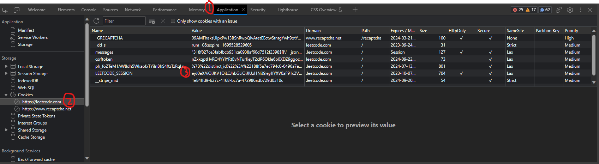

# GitSync

## What is GitSync

GitSync is a python script that uploads the most recent solution of all your Leetcode problems to Github. It is inspired [GitCode](https://github.com/andythsu/GitCode) because it is not realistic to sync all 2k questions from Leetcode to Github in a web extension.

## System requirements
everything is containerized so there's no need to worry about dependencies. All you need to have is Docker and you are all set.
## To run

`docker run -it -e LEETCODE_SESSION="<session>" --rm andythsu/gitsync`

## How to get LEETCODE_SESSION environment variable

1. Log in to https://leetcode.com
2. Open console by pressing `ctrl+shift+j` or right click and choose inspect
3. Navigate to Application tab
4. Select Cookies on the left panel
5. Copy the value for LEETCODE_SESSION



## Troubleshooting

```
Traceback (most recent call last):
  File "/usr/src/app/main.py", line 92, in <module>
    main()
  File "/usr/src/app/main.py", line 54, in main
    lc_api = LCApi()
             ^^^^^^^
  File "/usr/src/app/lc.py", line 17, in __init__
    self.test_lc_connection()
  File "/usr/src/app/lc.py", line 26, in test_lc_connection
    assert res["data"]["userStatus"]["isSignedIn"] is True
           ^^^^^^^^^^^^^^^^^^^^^^^^^^^^^^^^^^^^^^^^^^^^^^^
AssertionError
```

This error means the provided `LEETCODE_SESSION` failed to authenticate the user.
